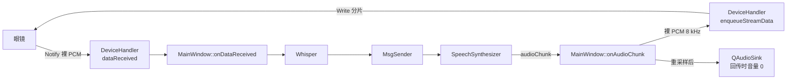

# 规格:TTS 音频经 BLE 回传眼镜

**状态:** 已实施,待真机验收
**日期:** 2026-09-12
**来源:** 承接 `.scratch/offline-tts/spec.md` —— 那份规格把「蓝牙回写、下行协议、眼镜侧播放」
明确列为**不在范围**。本次只补这条下行通路。

---

## 这份文档要做什么

把 sherpa-onnx 合成出的 PCM,**参照现有 BLE 读取通路**(通知上行 → `dataReceived` →
缓冲 → Whisper),通过 BLE 写入目标回传给眼镜,由眼镜播放。

**不在范围**(刻意不做):

- 音频编码/压缩(如 OPUS)—— 现状上行也是裸 PCM,压缩会让两侧格式不再对称
- 眼镜侧协议封装/分帧头 —— 上行读取没有头,回传也不加
- 第二个写入目标(文本与音频分走两条特征)—— 需要 UI 上的第二套选择交互,留待确认后再说
- 手机与眼镜同时出声(需要回声消除,不在本仓库能力范围)

---

## 一、冻结的决策

| 项 | 决定 |
|---|---|
| 下行目标 | **复用现有的「AI 回复输出」写入目标**(`DeviceHandler::setWriteTarget`)。眼镜那条特征在读取通路里本就是通知源,同一目标回传最贴近「参照现有 BLE 读取」 |
| 音频格式 | 模型原始 PCM:**8 kHz / 单声道 / int16 小端**,与上行同为未封装裸 PCM |
| 采样率转换 | **不转**。本机那段 `resampleLinearLe()` 只服务于 `QAudioSink` 的设备兼容性;回传音频由眼镜播放,不该迁就手机扬声器的能力 |
| 分包 | 沿用既有逻辑:`MTU - 3`,未知按 20 字节 |
| 发包节拍 | 普通下行仍固定 15 ms;流式音频按 `chunkSize × 1000 / (16000 × 1.5)` 自适应,钳在 10–50 ms |
| 忙时行为 | 新增**流式入队**:不拒绝,排队发送。`writeData()` 原有「正在发送上一条数据,请稍候」保留 |
| 积压上限 | **64 KiB(≈4 秒音频)**,到上限停止接收 → `streamAborted()` → 界面自动关闭回传 |
| 本机播放 | 回传开启时**静音但不停止** `QAudioSink` —— 见下方「为什么静音而不是停播」 |
| 文本回写 | 回传开启时**不再回写文本**。两者共用同一个写入目标,裸字节在协议上无法区分 |
| 终止时机 | `stopSpeaking()`、关闭开关、清空写入目标都会立刻丢掉未发出的音频 |

### 实施期记录(2026-09-12,构建机)

- `devicehandler.cpp` 原本在 `writeData()` 里自带 MTU 计算,已抽出 `writeChunkSize()`
  供流式路径复用,避免两处各算一遍。
- 队列元素由 `QByteArray` 变为 `struct WriteChunk { QByteArray data; bool oneShot; }`:
  只有普通下行整批发完才发 `writeFinished`,否则每排空一次队列就会往状态栏刷一条
  「AI 回复已通过蓝牙发送到眼镜」。
- 新增 `streamAborted(QString)` 信号。溢出与写入报错都走它,`MainWindow` 只接一处。

---

## 二、实施步骤与完成判据

> 判据分两类:**[静态]** 读代码/看文件即可判定;**[构建机]** 需 Linux + Android SDK + Qt;
> **[真机]** 需连接的眼镜。

### 步骤 1 — DeviceHandler 的流式下行队列 [静态][构建机]

- 新增 `enqueueStreamData()` / `clearStreamQueue()` / `streamAborted()`
- 队列积压记账 `m_streamQueuedBytes`,上限 `kMaxStreamQueueBytes`
- `startSendingIfIdle()` 统一「什么时候该发下一包」,含 `WriteWithResponse` 的
  `m_writeInFlight` 保护(原代码靠「忙时拒绝」隐式保证,流式下不再成立)

**完成判据 [构建机]:** `ninja libsmartglasses_android_app_arm64-v8a.so` 通过;
`-fsyntax-only` 对 `devicehandler.cpp` 无告警。

### 步骤 2 — MainWindow 把 TTS 音频接到 BLE [静态][构建机]

- `onAudioChunk()` 里镜像**重采样之前**的原始 PCM 到蓝牙
- `setBleAudioOut()` / `applyAudioVolume()`;`clearWriteTarget()` 里顺带关掉回传
- `onAIResponse()` 在回传开启时不回写文本

**完成判据 [构建机]:** 同上。

### 步骤 3 — QML 开关 [静态]

- 服务卡片新增「语音回传眼镜」开关,`enabled` 要求 `writeTarget !== "" && ttsReady`
- 状态行在回传开启时显示「语音回传: <特征>（本机静音）」
- `Connections` 回同步界面状态:后端会因溢出自闭回传,而用户点击会打断 `checked` 绑定

**完成判据 [静态]:** 卡片 `Layout.preferredHeight` 已加入 `audioOutRowH`,不会裁掉新行。

### 步骤 4 — 真机验收 [真机]

见 `.scratch/ble-audio-out/issues/04-verify-on-device.md`。**未做。**

---

## 三、为什么这样做(替代方案与取舍)

**为什么不能让 `onAudioChunk` 直接 `writeData()`。** `writeData()` 在队列非空时
直接报错拒绝。合成器是按真实时间连续产出的(每几十毫秒一块),用它意味着除了第一块
之外全部被丢掉。这不是参数问题,是接口语义问题:一条回复 = 一次原子写,
一条音频流 = 连续写。

**为什么静音而不是停播。** 回传时手机不该同时出声(回声),但 `QAudioSink` 在这条
流水线里还兼任**节拍器**:合成的推进由播放进度驱动(`kBacklogLowWaterBytes`),
「停止」的判定也要看音频是否已交给设备。停掉它,`m_pendingPcm` 永远排不空,
`writePendingAudio()` 会判定设备无响应并中止朗读。所以只把音量设为 0。

**已知代价:** `m_ttsReady` 依赖本机音频输出可用(`onTtsPrepared` 里
`m_ttsReady = (m_audioSink != nullptr)`),所以**手机完全没有音频输出设备时,
回传也用不了**。要解掉它得给流水线换一个与播放无关的节拍源,属于独立改动,不在本次范围。

**为什么溢出后是「停止回传」而不是「丢一部分继续」。** 丢中间一段会让眼镜放出一段
断裂、带爆音的语音,而且用户无法判断到底丢了哪些。停止 + 状态栏说明,至少状态是明确的。

## 四、数据流

## 五、待真机确认的不确定点

1. **眼镜期望的采样率**:按模型原始 8 kHz 发送。若眼镜按固定 16 kHz 解码,听到的会是
   半速慢放,需要在 `onAudioChunk()` 里先用现成的 `resampleLinearLe()` 升到 16 kHz
   (带宽翻倍,16 KB/s → 32 KB/s,更容易撞上吞吐上限)。
2. **实际吞吐**:取决于协商 MTU。MTU 517 时分包 514 字节、节拍约 21 ms ≈ 24 KB/s,
   余量充足;若只协商到 23,节拍被钳在 10 ms 也只有 2 KB/s,必然溢出。
3. **文本与音频是否该走同一条特征**:当前假设是。若固件要求分开,需要给
   `DeviceHandler` 加第二个写入目标并在服务列表里支持二次选择。
