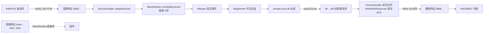

# 现状记录:ESP32-C3 开发板接入

**状态:** 待所有者确认 —— 这不是冻结决策,是 2026-10-03 对工作区未提交改动的盘点
**日期:** 2026-10-03
**来源:** 分析 `git diff` 里未提交的开发板适配代码,并与固件
`../../smartglasses_board/src/main.cpp` 逐条核对

> **核对的是固件的「工作区版本」,不是某个提交。** 该仓库当前分支是 `main`
> (不叫 master),最新提交 `c67bcf7 Add playback`,**但工作区是脏的**:
> `src/main.cpp` 有一版未提交的重写(+239/−103),把「ADC 模拟麦 + PWM 功放」
> 换成「I2S INMP441 数字麦 + I2S MAX98357 功放」,并新增麦克风存在性检测。
> 本文的**协议事实(UUID、16 kHz、三条特征的读写属性)两个版本一致**,
> 可以照用;但**引脚与发声方式只对工作区版本成立**。
> 另外 `.kilo/worktrees/acidic-buttercup` 只是 `c67bcf7` 的一次检出,不是另一版固件。

---

## 这份文档要做什么

眼镜项目的硬件已从「眼镜」变成一块 **ESP32-C3 开发板**(INMP441 麦克风 +
MAX98357 功放,见 `smartglasses_board`)。手机上这个 app 里已经有一版**未提交**的
适配改动。本文只记录**已经存在的事实**与**尚未决定的问题**,不替代所有者的决策。

与既有规格的关系:

- `.scratch/offline-tts/spec.md` 决定「手机扬声器播放」,并明确把蓝牙回写列为**不在范围**。
- `.scratch/ble-audio-out/spec.md` 补上了「TTS 音频经 BLE 回传」,但假设目标是**眼镜**,
  且把「眼镜期望的采样率」列为待真机确认的不确定点(第五节)。
- 开发板这条线**推翻了该假设**:目标板固件固定 16 kHz,且多了一条控制特征。
  两处结论都写在 `issues/02` 里。

---

## 一、固件侧事实(来自 `smartglasses_board/src/main.cpp`)

| 项 | 值 | 出处 |
|---|---|---|
| 设备名 | `ESP32_Audio` | `main.cpp:393` |
| 服务 UUID | `4fafc201-1fb5-459e-8fcc-c5c9c331914b` | `main.cpp:11` |
| 控制特征 | `beb5483e-…26a8`,READ + **WRITE** + NOTIFY | `main.cpp:12,400-405` |
| 麦克风上行特征 | `66666666-…6666`,READ + NOTIFY,每包 64 样本(128 B) | `main.cpp:13,18,411-416` |
| 扬声器下行特征 | `88888888-…8888`,READ + **WRITE** + NOTIFY | `main.cpp:14,419-426` |
| 采样率 | 16000 Hz,单声道 int16 | `main.cpp:17` |
| 控制指令 | `play` / `stop` / `volume:0-100` / `status` / `echo` | `main.cpp:124-172` |
| 播放前必须 `play` | 未进入播放态时,播放特征上的数据被直接丢弃 | `main.cpp:180-183` |
| 播放环形缓冲 | 512 样本(32 ms),满则丢新数据 | `main.cpp:55,196-208` |

两条与本 app 直接相关的固件缺陷:

1. **固件从不切换 MTU。** arduino-esp32 的本地 MTU 默认 23,只有显式调用
   `BLEDevice::setMTU()` 才会变大(`framework-arduinoespressif32/…/BLEDevice.cpp:551`,
   `main.cpp` 里没有这个调用)。后果见 `issues/02`。
2. **播放特征只支持有响应写(WRITE,无 WRITE_NR)。** 手机端每条分片都要等 ACK,
   吞吐被往返时延锁死。见 `issues/02`。

---

## 二、手机侧未提交改动做了什么

`git diff`(6 个文件,+250/−20)在 `master` 之上加了:

| 改动 | 位置 |
|---|---|
| `BoardProtocol` 协议常量(服务/三特征 UUID、16 kHz、play/stop) | `includes/devicehandler.h:14-28` |
| `DeviceHandler::servicePresent()` / `writeControlValue()` / `setStreamByteRate()` | `src/devicehandler.cpp:223-260,360-364` |
| 流式积压上限由固定 64 KiB 改为「字节率 × 4 秒」 | `src/devicehandler.cpp:306-313` |
| 服务详情发现完毕后自动识别开发板并配置三个特征 | `src/mainwindow.cpp:463-489` |
| `play`/`stop` 会话控制;16 kHz 回传重采样 | `src/mainwindow.cpp:503-535,807-812` |
| 开发板时不回写文本,只回传语音 | `src/mainwindow.cpp:663-666` |
| QML 状态行区分「开发板」与「AI 回复输出」 | `qml/Main.qml:437-439` |

静态检查结论(本次分析实测):

```
clang++ -fsyntax-only(compile_commands.json 的 Android 参数)
  devicehandler.cpp  exit 0
  mainwindow.cpp     exit 0
  whisper_manager.cpp exit 0
```

即**改动能编译**,但没有真机验证,也没有规格与工单 —— 见 `issues/01`。

同一份 `git diff` 还包含一处与开发板无关的改动:
`whisper_manager.cpp:121-129` 注释掉了若干解码参数。已单独建为
`.scratch/voice-pipeline/issues/03`,不要和开发板改动混在一起提交。

---

## 三、数据流(现状代码)



---

## 四、未决问题(不在这里下结论)

1. 这套适配要不要保留?改动未提交、无规格,所有者需要先决定走向 —— `issues/01`。
2. 下行带宽在当前固件下**不可能成立**,必须先改固件 —— `issues/02`。
3. 自动配置宣告成功但从不校验结果 —— `issues/03`。
4. 控制指令走了一条不受队列记账约束的旁路,且错误会误伤音频队列 —— `issues/04`。
5. 固件已支持的 `volume:` / `status` / `echo` 手机侧完全没用;界面没有音量控制 —— `issues/01`。
6. 真机验收判据尚无 —— `issues/05`。

## 五、刻意不在这里做的事

- 不改 `.scratch/ble-audio-out/spec.md` 与 `.scratch/offline-tts/spec.md`。
  它们是当时的决策留档;被推翻的前提(`issues/02` 里那条「Qt 不能请求 MTU」)
  记在工单里,不改历史文档。
- 不为开发板写「冻结决策」表。所有者还没确认这条路。
